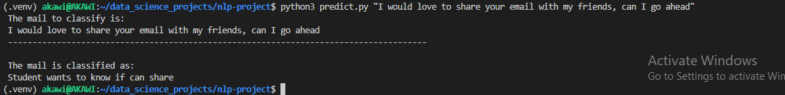

# Email Classification with BERT
This project finetunes a pretrained text classification `bert-base-uncased` model on an weirdly small dataset in order to implement email classification on the provided dataset.
### Background to the problem 
The problem assumes that Mary, a college student adviser helps students solve timetable clashes over email.
Suppose Mary is so helpful that students want to share her email address with their friends.  
To ensure students know they can share her email address, Mary has updated her signature to say, If you found this conversation helpful, feel free to share my email address with your friends.  
With the updated signature, Mary now gets about 250 emails from students a week either asking if they can share her email address with other students, or saying they’ve shared her email address with other students.

Most of the emails Mary gets are unpunctuated one liners, like the below:  
- "Can I share your email"  
- "I will share your email"
- "I shall share your email"
- "I've shared your email"
- "May I share your email"
- "Should I share your email"
- "I already shared the email"
- "I've just shared your email"
- "Am I allowed to share your email"
- "Am I able to share your email"
- "I am able to share your email"
- "Will you help my friends if I share your email with them?"

Mary has asked the college’s IT department to help her find or build some kind of filter that labels emails of this kind as either:  
**Student has shared**  or
**Student wants to know if can share**

### [Data Preparation, Tokenization and Modelling](https://github.com/Akawi85/Email-classification-with-bert/blob/main/train_model.ipynb)
##### Preparing the Dataset
From the problem statement, the sample emails provided by Mary constituted solely the dataset used for training this model. The sample email are just eleven (11) and since Mary is classifying the email into just two exclusive classes, a binary classification approach was adopted in executing the task.  
Since the dataset is so small, the correct class labels were manually allocated to each example email and loaded as a pandas dataframe.
See [the notebook](https://github.com/Akawi85/Email-classification-with-bert/blob/main/train_model.ipynb) for details on approaches taken in preparing the dataset.

##### Tokenization and Modelling
The curated/preprocessed dataset was tokenized using the pretrained `bert-base-uncased` checkpoint.  
The same pretrained checkpoint was used for training the model using the `AutoModelForSequenceClassification` API.  
The model trained on the sample emails dataset for 20 epochs and achieved an accuracy and f1 scores of `1.0` and `1.0` on the training dataset respectively.  
This metrics are highly flawed because we are evaluating on the same training set and can be ascribed to overfitting, but since we have no test set to evaluate on given the size of the sample data, we can assume that for the model to overfit at 20 epochs, it actually did well in learning to classify the training dataset to the extent of overfitting.  
All the model training checkpoints and weights were downloaded and saved in the [custom_model](https://github.com/Akawi85/Email-classification-with-bert/tree/main/custom_model) directory.

[The train_model.ipynb script](https://github.com/Akawi85/Email-classification-with-bert/blob/main/train_model.ipynb) shows how all of the data preparation, tokenization and modelling steps were implemented.

### Creating a Command Line Program that Predicts Email Class
The ultimate goal of the project is to create an easy to use program that will help classify Mary's emails into the appropriate classes.  
To do this, a program was created using the trained model, that accepts user inputs from the command line (email body) and outputs the class of the input as shown below:

[The predict.py script](https://github.com/Akawi85/Email-classification-with-bert/blob/main/predict.py) shows how the program was implemented in the command line as well as how errors and other input format specifications were handled when passing arguments to the program.  

### [Testing](https://github.com/Akawi85/Email-classification-with-bert/blob/main/test.py)
The [test.py](https://github.com/Akawi85/Email-classification-with-bert/blob/main/test.py) script implements unit testing of the various functionalities of the program.

### Running the program on your machine

